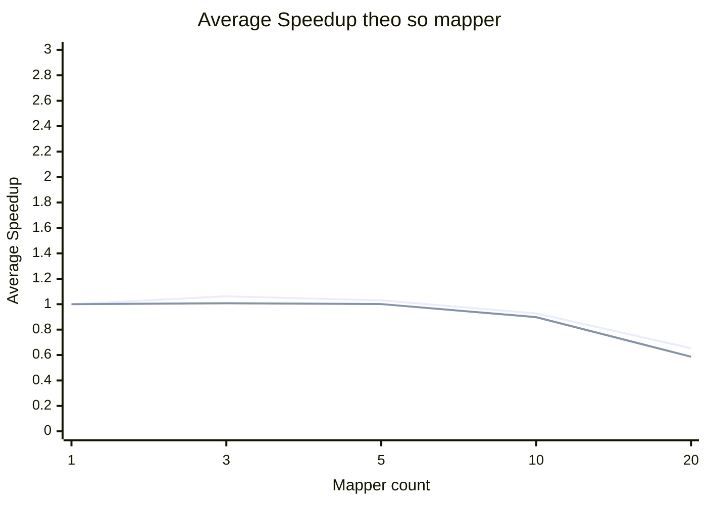

# So do duong Speedup trung binh theo Mapper - Online Retail II

Benchmark chay moi mapper count 3 lan, tinh thoi gian trung binh roi tinh Speedup.

Cong thuc:

```text
AverageSpeedup(m) = AverageTime(1 mapper) / AverageTime(m mappers)
```

## Bang Speedup trung binh

| MapReduce Job Map | Speedup 1 Mapper | Speedup 3 Mappers | Speedup 5 Mappers | Speedup 10 Mappers | Speedup 20 Mappers |
|---|---:|---:|---:|---:|---:|
| mapreduce_job_map_q1_invoice_count_by_country | 1 | 1.062 | 1.03 | 0.928 | 0.654 |
| mapreduce_job_map_q2_distinct_customer_count_by_country | 1 | 1.007 | 1.001 | 0.898 | 0.587 |

## So do duong Speedup



Ghi chu: moi duong tuong ung mot MapReduce Job Map theo thu tu bang tren.

## Du lieu trung binh

| Mapper count | MapReduce Job Map | Average seconds | Average speedup |
|---:|---|---:|---:|
| 1 | mapreduce_job_map_q1_invoice_count_by_country | 76.807 | 1 |
| 3 | mapreduce_job_map_q1_invoice_count_by_country | 72.292 | 1.062 |
| 5 | mapreduce_job_map_q1_invoice_count_by_country | 74.543 | 1.03 |
| 10 | mapreduce_job_map_q1_invoice_count_by_country | 82.729 | 0.928 |
| 20 | mapreduce_job_map_q1_invoice_count_by_country | 117.476 | 0.654 |
| 1 | mapreduce_job_map_q2_distinct_customer_count_by_country | 71.947 | 1 |
| 3 | mapreduce_job_map_q2_distinct_customer_count_by_country | 71.435 | 1.007 |
| 5 | mapreduce_job_map_q2_distinct_customer_count_by_country | 71.879 | 1.001 |
| 10 | mapreduce_job_map_q2_distinct_customer_count_by_country | 80.081 | 0.898 |
| 20 | mapreduce_job_map_q2_distinct_customer_count_by_country | 122.523 | 0.587 |

## Nhan xet can dien

- Neu Speedup tang khi tang mapper: job tan dung duoc chia nho input va xu ly song song tot hon.
- Neu Speedup tang cham hoac giam: co the do overhead tao mapper, shuffle/sort, I/O HDFS, hoac container resource.
