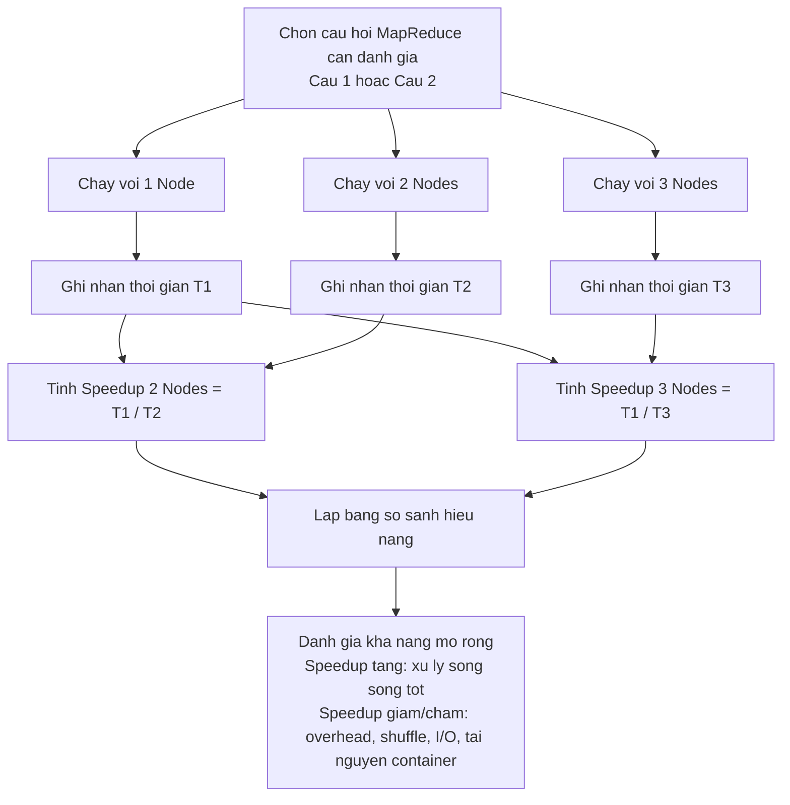

# So do danh gia Speedup - Online Retail II

File nay mo ta phan can ve trong yeu cau danh gia hieu nang khi scale cum Hadoop voi 1 Node, 2 Nodes, 3 Nodes.

Cong thuc:

```text
Speedup = T1 / Tn
```

Trong do:

- `T1`: thoi gian chay voi 1 node.
- `Tn`: thoi gian chay voi n nodes, vi du `T2` hoac `T3`.

## So do tinh Speedup



## Bang ket qua can ghi

| Cau hoi | So node | Thoi gian chay | Cong thuc Speedup | Speedup |
|---|---:|---:|---|---:|
| Cau 1 | 1 | `T1_q1` | `T1_q1 / T1_q1` | 1.000 |
| Cau 1 | 2 | `T2_q1` | `T1_q1 / T2_q1` | ... |
| Cau 1 | 3 | `T3_q1` | `T1_q1 / T3_q1` | ... |
| Cau 2 | 1 | `T1_q2` | `T1_q2 / T1_q2` | 1.000 |
| Cau 2 | 2 | `T2_q2` | `T1_q2 / T2_q2` | ... |
| Cau 2 | 3 | `T3_q2` | `T1_q2 / T3_q2` | ... |

## Noi thuc hien trong code

- File `scripts/run-online-retail-analysis.sh` ghi thoi gian tung job vao `/data/online_retail_times.tsv`.
- File `scripts/benchmark-online-retail-scaling.ps1` chay lan luot 1, 2, 3 nodes va tinh Speedup.
- Ket qua benchmark duoc xuat ra `cmd_logs/online_retail_scaling_results.csv`.

## Cach doc ket qua

- `Speedup = 1`: cau hinh n nodes khong nhanh hon 1 node.
- `Speedup > 1`: chay nhanh hon 1 node.
- `Speedup` cang gan `n` thi kha nang mo rong cang tot.
- `Speedup` tang cham hoac giam co the do overhead khoi dong job, shuffle/sort, doc ghi HDFS, hoac tai nguyen container chua phu hop.
