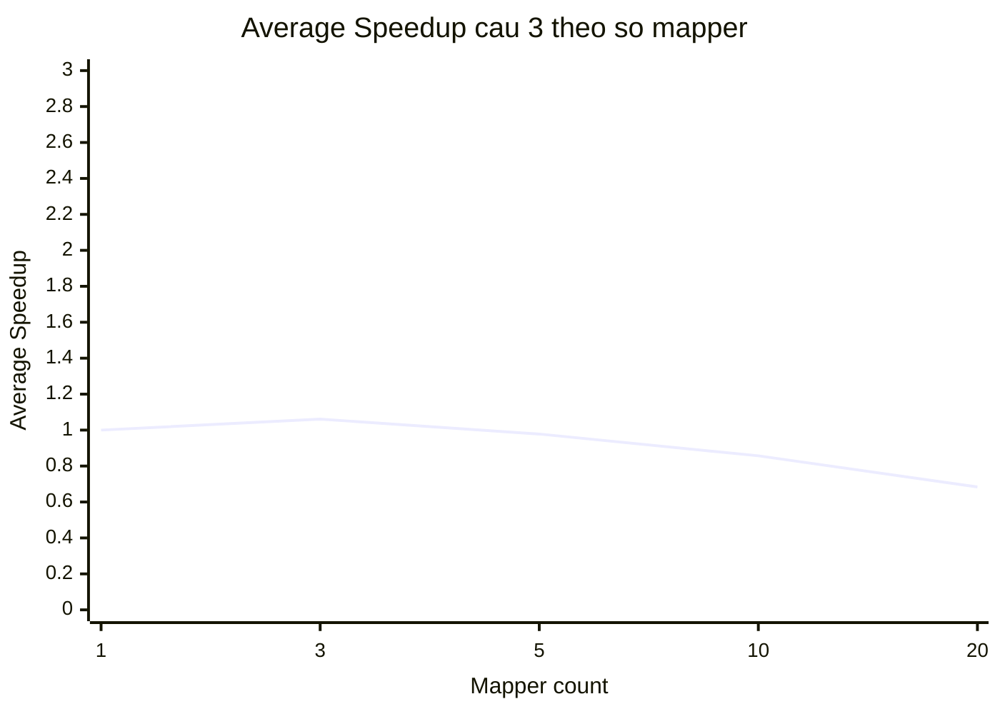

# So do duong Speedup cau 3 theo Mapper - Online Retail II

Benchmark cau 3 chay moi mapper count 3 lan, tinh thoi gian trung binh roi tinh Speedup.

Cong thuc:

```text
AverageSpeedup(m) = AverageTime(1 mapper) / AverageTime(m mappers)
```

## Bang Speedup trung binh cau 3

| MapReduce Job Map | Speedup 1 Mapper | Speedup 3 Mappers | Speedup 5 Mappers | Speedup 10 Mappers | Speedup 20 Mappers |
|---|---:|---:|---:|---:|---:|
| mapreduce_job_map_q3_top_customer_by_country | 1 | 1.061 | 0.978 | 0.857 | 0.684 |

## So do duong Speedup cau 3



## Du lieu trung binh cau 3

| Mapper count | MapReduce Job Map | Average seconds | Average speedup |
|---:|---|---:|---:|
| 1 | mapreduce_job_map_q3_top_customer_by_country | 74.083 | 1 |
| 3 | mapreduce_job_map_q3_top_customer_by_country | 69.811 | 1.061 |
| 5 | mapreduce_job_map_q3_top_customer_by_country | 75.78 | 0.978 |
| 10 | mapreduce_job_map_q3_top_customer_by_country | 86.448 | 0.857 |
| 20 | mapreduce_job_map_q3_top_customer_by_country | 108.242 | 0.684 |

## Nhan xet

- Neu Speedup tang khi tang mapper: q3 tan dung duoc chia nho input va xu ly song song tot hon.
- Neu Speedup giam khi mapper qua lon: overhead tao mapper, shuffle/sort va gom top customer co the lon hon loi ich song song.
