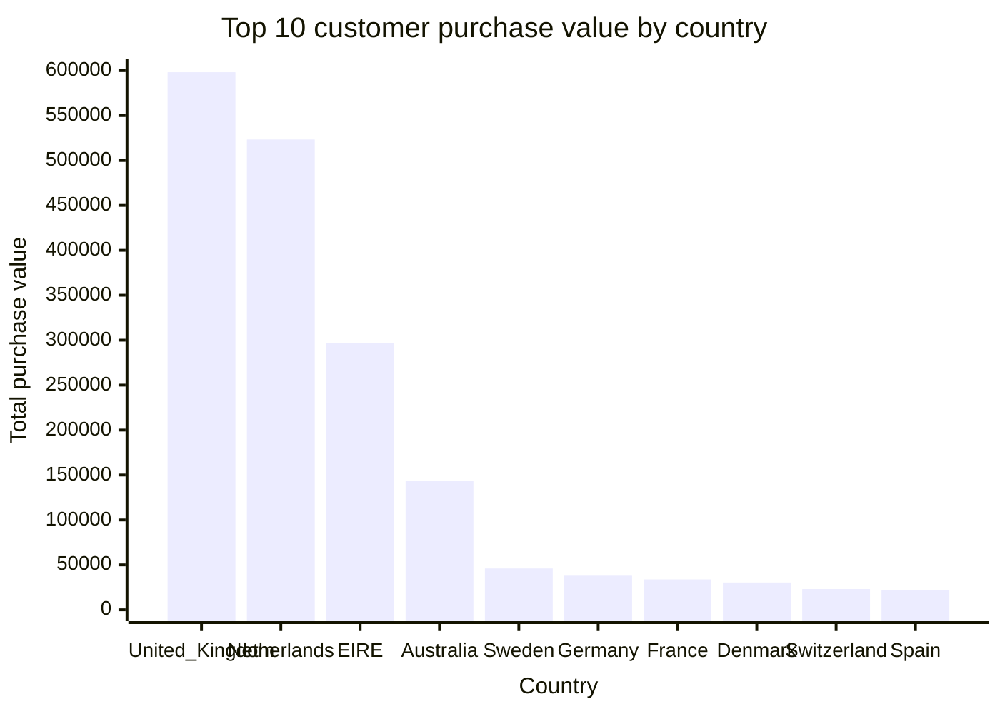

# Bieu do cau 3 - Top customer theo Country

Cau 3: Khach hang nao co gia tri mua hang cao nhat o moi quoc gia.

Gia tri mua hang duoc tinh bang:

```text
TotalPurchaseValue = SUM(Quantity * Price)
```

## Bieu do Top 10 quoc gia theo gia tri mua hang cao nhat



## Bang ket qua cau 3

| Country | Customer ID | Total purchase value |
|---|---:|---:|
| United Kingdom | 18102 | 598215.22 |
| Netherlands | 14646 | 523342.07 |
| EIRE | 14156 | 296564.69 |
| Australia | 12415 | 143269.29 |
| Sweden | 17404 | 46006.82 |
| Germany | 12471 | 37948.61 |
| France | 12678 | 33851.13 |
| Denmark | 13902 | 30411.26 |
| Switzerland | 12409 | 23090.47 |
| Spain | 12540 | 22107.29 |
| Japan | 12753 | 21024.01 |
| Norway | 12433 | 20428.86 |
| Singapore | 12744 | 13158.16 |
| Channel Islands | 14936 | 12378.46 |
| Portugal | 12766 | 10026.43 |
| Greece | 14439 | 9443.04 |
| Cyprus | 12359 | 8714.89 |
| Belgium | 12380 | 7888 |
| Finland | 12428 | 7877.2 |
| Lithuania | 15332 | 6553.74 |
| Poland | 12779 | 6406.76 |
| Iceland | 12347 | 5633.32 |
| Italy | 12594 | 5044.51 |
| Israel | 12688 | 4873.81 |
| United Arab Emirates | 17829 | 4680.42 |
| Unspecified | 16320 | 4428.85 |
| Austria | 12360 | 4212.89 |
| Malta | 15480 | 3592.25 |
| Thailand | 12469 | 3070.54 |
| Canada | 17444 | 2940.04 |
| USA | 12733 | 2326.82 |
| Lebanon | 12764 | 1693.88 |
| European Community | 15108 | 1291.75 |
| Brazil | 12769 | 1143.6 |
| RSA | 12446 | 1002.31 |
| Korea | 12767 | 949.82 |
| Bahrain | 12355 | 947.61 |
| Czech Republic | 12781 | 707.72 |
| West Indies | 18140 | 536.41 |
| Nigeria | 15702 | 140.39 |
| Saudi Arabia | 12565 | 131.17 |

## Nhan xet

- Cac quoc gia co gia tri top customer cao thuong la noi co don hang lon hoac khach hang mua lap lai nhieu.
- Neu mot quoc gia co total am hoac rat thap, co the do giao dich huy/tra hang lam giam tong Quantity * Price.
