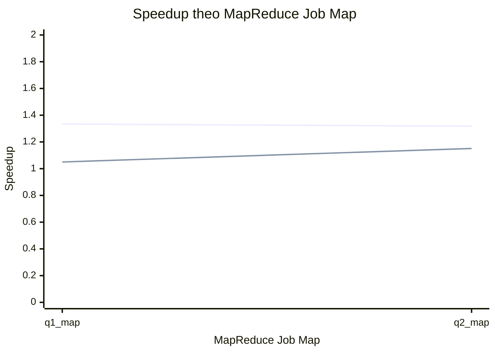

# So do Speedup theo MapReduce Job Map - Online Retail II

File nay duoc tao sau khi chay benchmark 1, 2, 3 nodes.

Cong thuc:

```text
Speedup = T1 / Tn
```

## Bang Speedup theo MapReduce Job Map

| MapReduce Job Map | Speedup 1 Node | Speedup 2 Nodes | Speedup 3 Nodes |
|---|---:|---:|---:|
| mapreduce_job_map_q1_invoice_count_by_country | 1 | 1.334 | 1.05 |
| mapreduce_job_map_q2_distinct_customer_count_by_country | 1 | 1.318 | 1.151 |

## So do duong Speedup



Ghi chu: q1_map = mapreduce_job_map_q1_invoice_count_by_country; q2_map = mapreduce_job_map_q2_distinct_customer_count_by_country.

Duong thu nhat la Speedup 2 Nodes, duong thu hai la Speedup 3 Nodes.

## Chi tiet q1_invoice_count_by_country

| So node | Thoi gian chay | Speedup |
|---:|---:|---:|
| 1 | 95.184 | 1 |
| 2 | 71.334 | 1.334 |
| 3 | 90.677 | 1.05 |

## Chi tiet q2_distinct_customer_count_by_country

| So node | Thoi gian chay | Speedup |
|---:|---:|---:|
| 1 | 87.264 | 1 |
| 2 | 66.221 | 1.318 |
| 3 | 75.788 | 1.151 |

## Nhan xet

- Hang MapReduce Job Map duoc dat theo dang mapreduce_job_map_<ten_job>.
- Cot Speedup cho biet toc do nhanh hon so voi cau hinh 1 node.
- Speedup tang cham hoac giam co the do overhead khoi dong job, shuffle/sort, I/O HDFS, hoac tai nguyen container.
